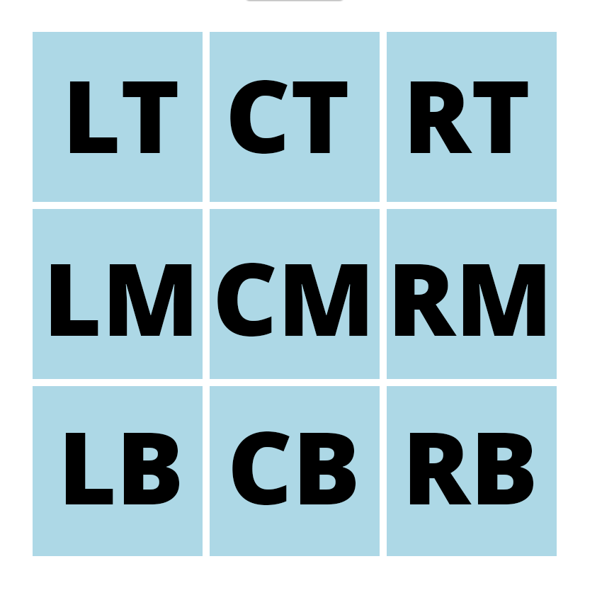

# TicTacToe

Tijdens deze hands-on sessie gaan we Vue leren kennen. Dit door het spel TicTacToe (/Boter-kaas-en-eieren) te bouwen (https://nl.wikipedia.org/wiki/Boter-kaas-en-eieren).

# Voorbereiding

Om te kunnen starten dien je allereerst het commando "npm install" te draaien. Dit commando installeert alle dependencies van het project.
Om vervolgens de code te kunnen draaien kan je het commando "npm run start" draaien.

De startstructuur bestaat uit een App.vue die als de 'root' van onze Single Page Application werkt. Deze bevat één standaard view, namelijk Home. Initieel is het handig om alle componenten in Home plaatsen. Later gaan we nog wat doen met routing. Wees dan vooral vrij om het in te delen zoals je het zelf mooi vindt!

# Opdracht 1
>Maak een component voor het spel TicTacToe (components/TicTactoe.vue). Een leeg component ziet er als volgt uit: 
```html
<template>
</template>

<script>
  export default {
  }
</script>

<style scoped>
</style>
```

Import het component in Home.vue
```js 
import TicTacToe from './components/TicTacToe.vue';
```
Declare het component in Home.vue
```js
export default {
  components: {
    TicTacToe
  }
}
```
Zet het in de template:
```html
<div id="home">
  <TicTacToe></TicTacToe>   
</div>
``` 

# Opdracht 2
> Maak een component om het speelbord weer te geven.

Om het spel te kunnen spelen zijn moet er een speelbord komen. Deze bestaat uit een veld van 9 (3x3) vlakken. Voor het gemak kun je gebruik maken van onderstaande CSS. We maken gebruik van CSS-Grid.

```html
  <div class="grid">...</div>
```
```css
.grid {
  display: grid;
  grid-gap: 5px 5px;
  grid-template-columns: auto auto auto;
  justify-content: center;
  margin-top: 20px;
}
```

> Maak voor de vlakken in het bord ook een component.

Een component heeft altijd zijn eigen state. Delen van de app die vaker worden hergebruikt zijn dus ook uitstekend geschikt als component. Zorg daarom dat er een component komt voor de vlakken in het speelbord.

Zorg dat het component alleen gegevens vasthoudt die ook echt nodig zijn! Hierbij houdt het bordcomponent dus alle generieke dingen vast en de cel/vlak alleen wat deze nodig is.

Voor deze vlakken kan je eventueel onderstaande CSS gebruiken. Zorg wel dat je de CSS alleen toepast op het component zelf!

```css
div {
    background: lightblue;
    font-size: 110px;
    height: 120px;
    line-height: 110px;
    width: 120px;
}
```

# Opdracht 3
> Zorg dat het bord speelbaar wordt (Winsituaties e.d. zijn hier nog niet van belang. Dit komt in latere opdrachten)

Er moet op een vak geklikt kunnen worden. Dit moet vervolgens opgeslagen worden en getoond op het scherm. Het speelveld is opgeslagen in het bordcomponent. De cel zou dus tegen het bord moeten vertellen dat er op hem een zet is gedaan. Vervolgens vertelt het bord weer aan de cel welk teken (X of O) hij moet tonen. 
We bouwen dit op deze manier omdat het bord verantwoordelijk is voor het speelveld. Het enige wat een cel hoeft te weten is wat zijn positie op het speelveld is en welk teken getoond moet worden. Het speelveld (in component bord) houdt bij waar welke marker staat en verteld dit dus aan de desbetreffende cellen op basis van de positie; Left Top, Center Top, Left Center, etc. 
Ter illustratie (en het is gemakkelijker deze afkortingen ook aan te houden):


# Opdracht 4

> Belangrijk bij dit spel is om te zien wie er aan de beurt is en of er gewonnen is (of gelijkspel). 

Zorg dat het bord component het volgende bijhoudt en toont:
* Wie is er nu aan de beurt?
* Heeft er iemand gewonnen?
* Is het gelijkspel?

De focus ligt tijdens deze opdrachten op Vue, niet op het uitwerken van de spellogica. Daarom krijg je deze code cadeau. Deze methode geeft een boolean terug of het spel door één van beide spelers is gewonnen.

```javascript
function gameIsWon() {
 return cellsAreEqual(this.cellMarkers.LT, this.cellMarkers.CT, this.cellMarkers.RT) 
        || cellsAreEqual(this.cellMarkers.LM, this.cellMarkers.CM, this.cellMarkers.RM)
        || cellsAreEqual(this.cellMarkers.LB, this.cellMarkers.CB, this.cellMarkers.RB)
        || cellsAreEqual(this.cellMarkers.LT, this.cellMarkers.LM, this.cellMarkers.LB)
        || cellsAreEqual(this.cellMarkers.CT, this.cellMarkers.CM, this.cellMarkers.CB)
        || cellsAreEqual(this.cellMarkers.RT, this.cellMarkers.RM, this.cellMarkers.RB)
        || cellsAreEqual(this.cellMarkers.LT, this.cellMarkers.CM, this.cellMarkers.RB)
        || cellsAreEqual(this.cellMarkers.LB, this.cellMarkers.CM, state.cellMarkers.RT)
          
     function cellsAreEqual(firstCell, secondCell, thirdCell) {
       return firstCell !== ''   && firstCell === secondCell && secondCell === thirdCell; 
     }
}
```

# Opdracht 5

> New game

Zorg dat er een knop komt om het spel te opnieuw te spelen. Deze knop mag alleen beschikbaar zijn als het spel is afgelopen.

# Opdracht 6
> Zet een Vuex Store op

Naarmate de code uitgebreid wordt, wordt het ook complexer. Door gebruik te maken van een store kan veel logica op één plek worden neergezet. Dit zorgt ervoor dat de code begrijpbaarder wordt. Dit zorgt er ook voor dat de componenten 'dommer' worden (er zit minder tot geen logica in de componenten).

De store bevindt zich in de file store.js en bevat een aantal dingen:
* state. Bevat de daadwerkelijke data
* mutations. Bevat de methodes om de state te muteren
* getters. Bevat de methodes om data uit de state op te halen

**LET OP: Een store mag alleen via mutations worden aangepast!**

Een methode in de store kan zowel de state als de getters meekrijgen. Dit kan door ze simpelweg als parameter in de methode neer te zetten:
```javascript
getWinner: function(state, getters) {
    return getters.gameIsWon ? state.currentPlayer: null;
}
```

# Opdracht 7
> Voeg een scorebord component toe

Voeg een extra component toe dat met behulp van de Vuex store de score kan bijhouden. Toon deze ook op het scherm.


# Opdracht 8
> Historie en score op een losse pagina

Zorg dat je in de state ook een historie van de zetten bijhoudt. Hierbij wil je terug kunnen zien welke zetten er gedaan zijn tijdens een potje (dit kan per potje of doorlopend over meerdere potjes. Zorg dan dat er goed zichtbaar is wanneer een nieuw potje begint). Een goed voorbeeld hiervan is schaken, waar ze ook altijd bijhouden welke zetten zijn gedaan.

Toon vervolgens op een losse pagina (gebruik routing) deze historie vanuit de store. Plaats de view componenten in het mapje 'views'.
Dit het voorbeeld van hoe routing er in een template uit ziet (https://router.vuejs.org/guide/#html).

De posities worden ook getoond in de historie en worden nu geïdentifcieerd door een afkorting (LT = Linksboven, CM, midden, RB, rechtsonder). Zorg dat er een filter (pipe) komt die deze afkortingen vertaalt naar een mooie Nederlandse tekst (https://vuejs.org/v2/guide/filters.html).

 ```javascript 
 <template>
  <div id="app">
    <div id="nav">
      <router-link to="/">Home</router-link>
    </div>
    <router-view/>
  </div>
</template>

 ```
